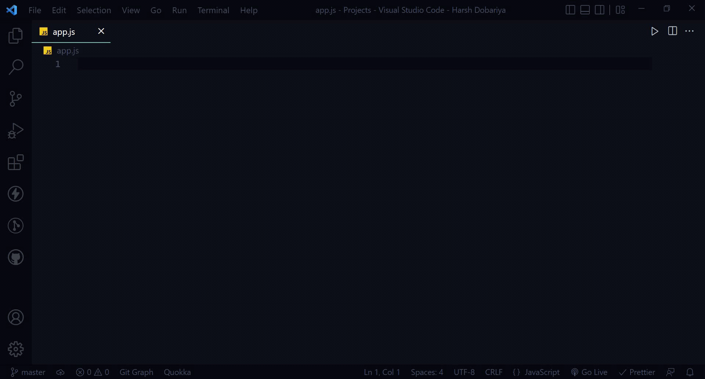

a# NodeJS Code Snippets

The essential collection of Nodejs snippets.

## Author

<a href="https://github.com/Harsh-Dobariya">@ Harsh Dobariya</a>

## Features

Only what you need and nothing more.

Simply, simple Nodejs snippets.

These snippets were selected carefully from my own day-to-day NodeJS use. Not
everything in NodeJS is included here. This is a hand selected set of snippets
that work the way that you would expect, not just a copy of the documentation.

## Usages



## NodeJS Snippets

| Snippet    | Renders                                 |
| ---------- | --------------------------------------- |
| `requ`     | create require statement                |
| `exstatic` | Express set the static folder           |
| `exue`     | Express URL encoded                     |
| `exjson`   | Express set to use json                 |
| `ergr`     | A router based get route                |
| `erpr`     | A router based post route               |
| `esgr`     | A simple based get route                |
| `espr`     | A simple based post route               |
| `exs`      | Express simple Hello world server Setup |
| `exr`      | Express routes for server               |
| `mongodbc` | MongoDB database connection             |
| `mysqlc`   | MySQL database connection               |
| `gns`      | Define schema of data in API            |
| `pass`     | Defining passport strategy              |
| `mails`    | Sending mail to user                    |
| `dbug`     | Generating debugging variables          |

## Swagger Snippets

| Snippet  | Renders                 |
| -------- | ----------------------- |
| `swbi`   | Swagger basic info      |
| `swsi`   | Swagger server info     |
| `swtg`   | Swagger Tags            |
| `sws`    | Swagger Security Schema |
| `swscs`  | Swagger String Schema   |
| `swsco`  | Swagger Object Schema   |
| `swpath` | Swagger Path            |

## NodeJS Full Expansions

### exstatic - Express set the static folder

```javascript
app.use(express.static("public"));
```

### exue - Express URL encoded

```javascript
app.use(express.urlencoded({ extended: false }));
```

### exjson - Express set to use json

```javascript
app.use(express.json());
```

### esgr - A simple based get route

```javascript
app.get("", (request, response) => {});
```

### espr - A simple based post route

```javascript
app.post("", (request, response) => {});
```

### exs - Express simple Hello world server Setup

```javascript
const express = require("express");
const app = express();

app.get("/", (req, res) => {
    res.send("Hello world");
});

const port = process.env.PORT || 5000;
app.listen(port, () => console.log(`Server is running on...http://localhost:${port}`));
```

## Swagger Full Expansions

### swbi - Swagger basic info

```javascript
module.exports = {
    openapi: "3.0.0",
    info: {
        version: "1.0.0",
        title: "",
        description: "",
        contact: {
            name: "",
            email: "",
            url: ""
        }
    }
};
```

### swsco - Swagger Object Schema

```javascript
module.exports = {
    components: {
        schemas: {
            Error: {
                type: "object",
                description: "error object",
                properties: {
                    error: {
                        type: "string",
                        description: "error message",
                        example: "NOT_FOUND"
                    }
                }
            }
        }
    }
};
```

## Thank You! ❤️
